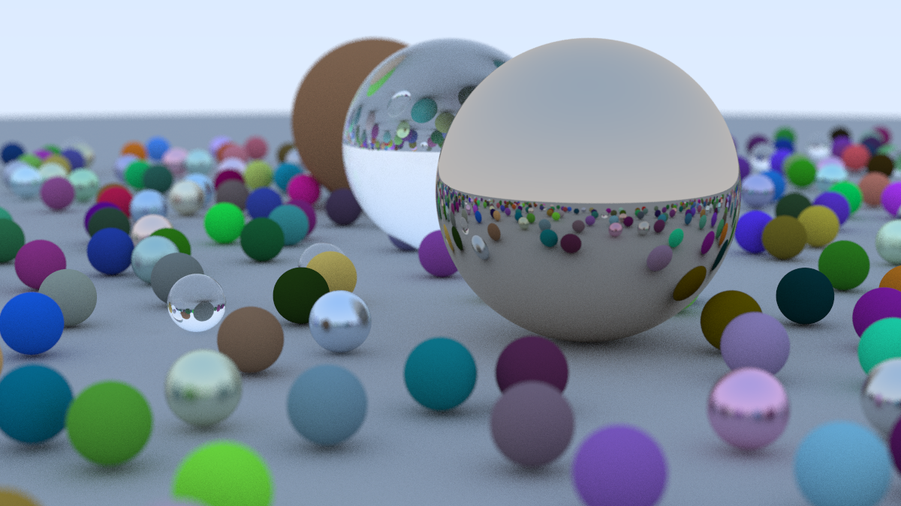
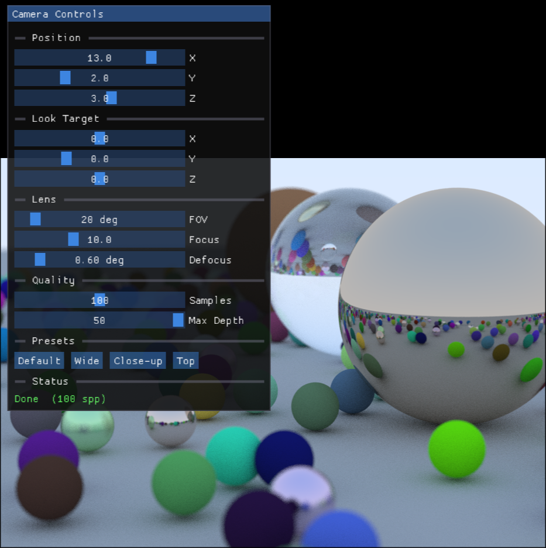
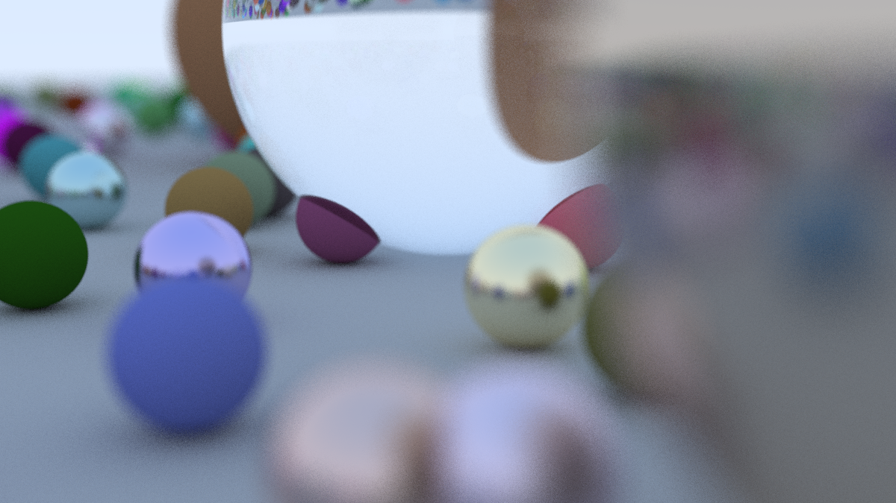
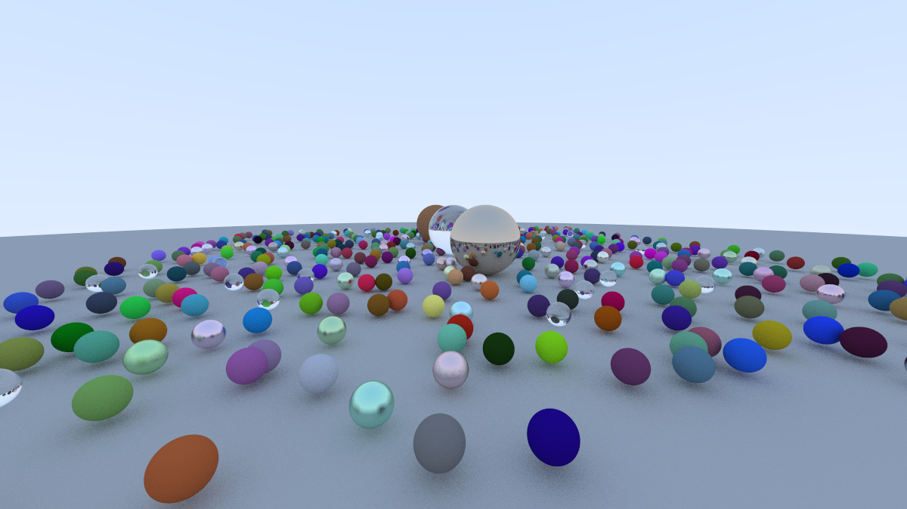
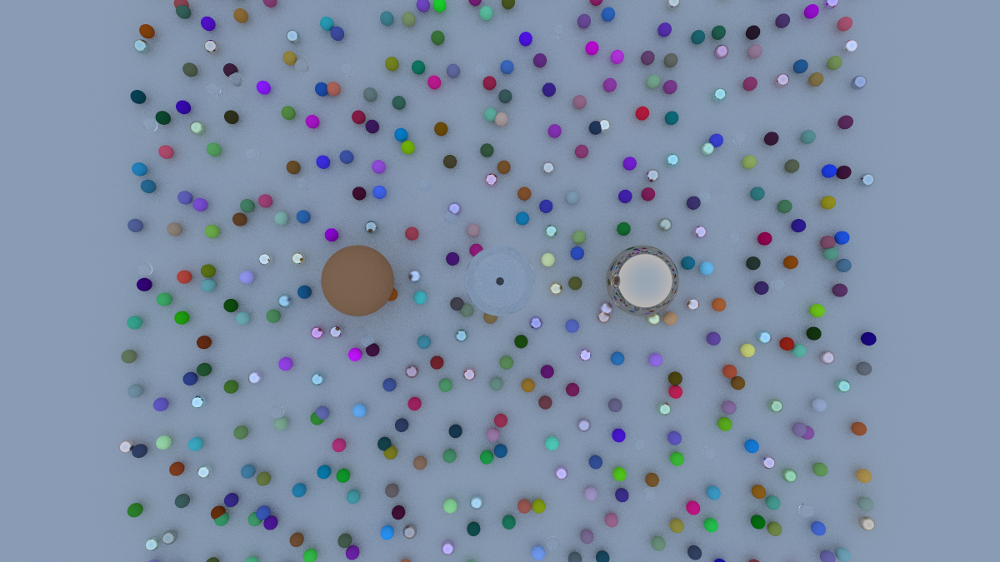

# CPU Raytracer

A physically-based path tracer written in C++ with a real-time interactive preview window. Renders a scene of randomly-generated spheres with three material types and lets you adjust every camera parameter live via an ImGui control panel.

---

## Demo



---

## Features

- **Progressive rendering** — image refines pass-by-pass in a live OpenGL window; you see the result converge in real time
- **Three material types**
  - Lambertian (diffuse) — matte surfaces with Cosine-weighted scatter
  - Metal — specular reflection with configurable fuzz
  - Dielectric — glass/refractive surfaces using Schlick's approximation
- **Bounding Volume Hierarchy (BVH)** — axis-aligned bounding box tree for fast ray-object intersection
- **Depth-of-field** — adjustable defocus angle and focus distance for realistic lens blur
- **ImGui control panel** — tweak camera position, look target, FOV, lens, and quality settings without recompiling; collapse the panel to a title bar by double-clicking it
- **PPM export** — save the current render to a timestamped `.ppm` file with one button click
- **Debounced re-render** — dragging a slider waits 500 ms of silence before restarting, so intermediate positions don't trigger expensive full renders
- **OpenMP parallelism** — each render pass is distributed across all CPU threads
- **Gamma correction on GPU** — linear-light framebuffer stays in double precision on the CPU; the fragment shader applies gamma 2.0 correction via `sqrt`
- **Camera presets** — one-click Default, Wide, Close-up, and Top views

---

## Screenshots









---

## Building

### Dependencies

| Library | Purpose |
|---------|---------|
| OpenMP  | Multi-threaded rendering |
| OpenGL  | GPU display / gamma shader |
| GLFW 3  | Window creation and input |
| libepoxy | OpenGL function loading (Wayland/EGL compatible) |
| ImGui   | Control panel UI (fetched automatically by CMake) |

On Arch Linux:
```bash
sudo pacman -S openmp mesa glfw-x11 libepoxy
```

On Ubuntu/Debian:
```bash
sudo apt install libomp-dev libgl-dev libglfw3-dev libepoxy-dev
```

### Compile

```bash
cmake -B build -DCMAKE_BUILD_TYPE=Release
cmake --build build -j$(nproc)
```

### Run

```bash
./build/Main
```

---

## Controls

| Control | Action |
|---------|--------|
| ImGui sliders | Adjust camera in real time |
| **Default / Wide / Close-up / Top** buttons | Jump to a preset view |
| **Export PPM** button | Save current render to a timestamped `.ppm` file |
| Double-click title bar | Collapse / expand the control panel |
| `Q` or `Esc` | Close the window |

---

## Project Structure

```
.
├── Main.cpp          # Entry point — scene setup and main render loop
├── camera.h          # Camera math, per-pass rendering, OMP parallelism
├── camera_state.h    # Plain-data camera parameters + preset definitions
├── ui.h              # ImGui panel, RenderState (debounce logic)
├── display.h         # GLFW window, OpenGL texture, gamma-correction shader
├── material.h        # Lambertian, Metal, Dielectric material classes
├── hittable.h        # Abstract hittable interface and hit_record
├── hittable_list.h   # Collection of hittables
├── sphere.h          # Sphere primitive
├── bvh.h             # Bounding Volume Hierarchy acceleration structure
├── aabb.h            # Axis-Aligned Bounding Box
├── ray.h             # Ray class
├── vec3.h            # 3D vector / colour math
├── colour.h          # Colour output helpers
├── interval.h        # Scalar interval [min, max]
└── raytrace.h        # Common includes and utility functions
```

---

## How It Works

1. **Scene** — a large grey ground sphere plus ~484 small randomly-placed spheres (80% lambertian, 15% metal, 5% glass) and three large feature spheres (glass, lambertian, mirror metal).
2. **BVH** — the scene is wrapped in a `bvh_node` tree at startup, reducing intersection cost from O(n) to O(log n).
3. **Render loop** — each frame, `camera::render_pass()` adds one Monte Carlo sample per pixel into a `colour` accumulation buffer. After accumulation, `accumulate_to_staging()` divides by the pass count and writes a `float` buffer that is uploaded to a GPU texture.
4. **Display** — a fullscreen triangle-strip quad samples the texture; the fragment shader applies `sqrt` for gamma 2.0 correction.
5. **UI** — ImGui overlays the textured quad. Any slider change calls `RenderState::mark_dirty()`, starting a 500 ms debounce timer before the render restarts. The panel can be collapsed to just its title bar by double-clicking it.
6. **Export** — clicking "Export PPM" writes the current `staging` buffer to a `render_YYYYMMDD_HHMMSS.ppm` file, applying the same sqrt gamma-2.0 correction used by the GPU shader.

---

## References

- [_Ray Tracing in One Weekend_](https://raytracing.github.io/books/RayTracingInOneWeekend.html) — Peter Shirley
